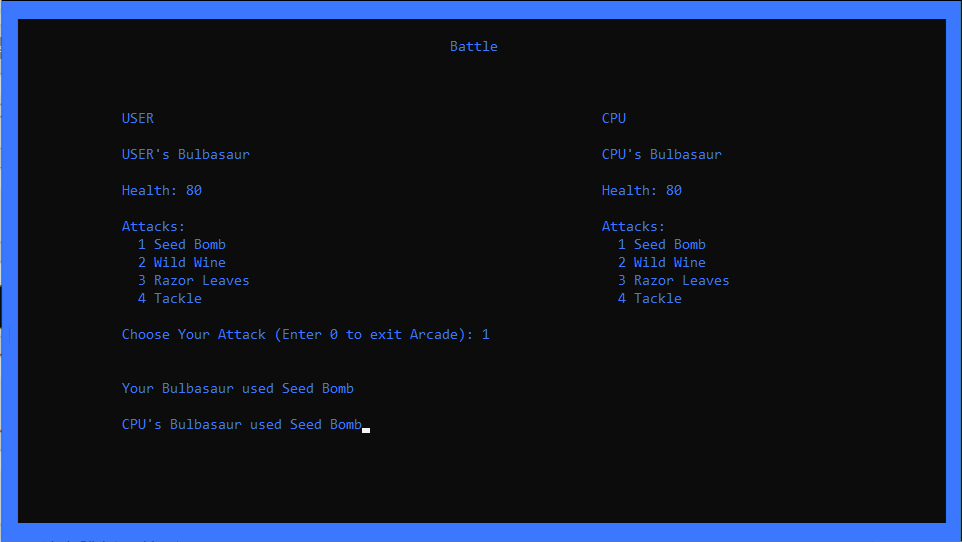
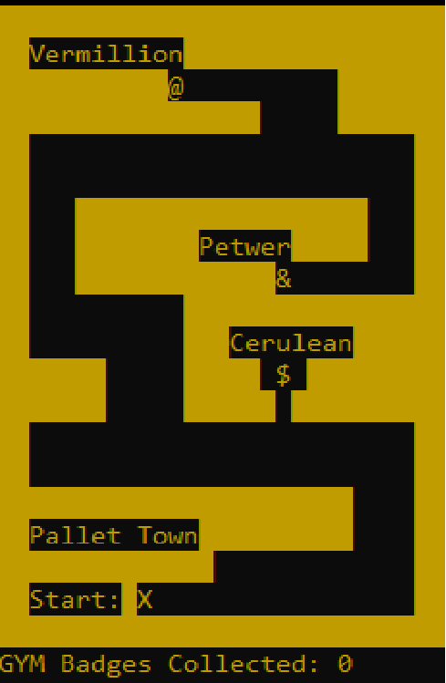
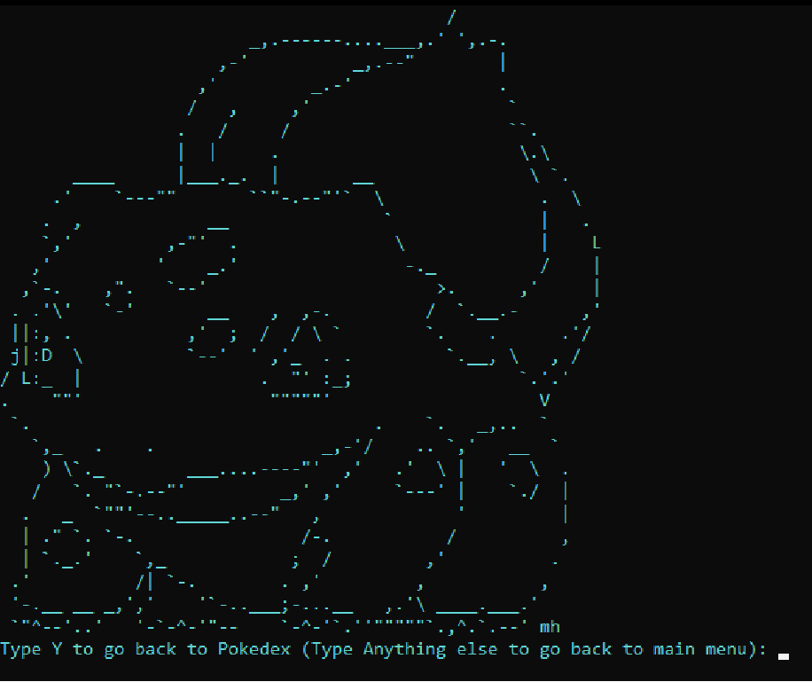

# Pokemon-CLIGame
This is a game similar to original Pokemon Red and Blue at a core level. This game completely runs through the use of ASCII Characters in the console window.  This was developed as a summer project for my university.

# Starting Screen
  this is the Starting screen of the game where you can chose the arcade mode , story mode and the pokidex.
  
  
# Arcade Mode
  this is the arcade mode in which you can choose the pokimon of your liking and you can fight with the Cpu in a one-on-one arcade match.
  
# Story Mode
  Story mode is where you roam in the map and go from one gym to another challenging gym master, You get a badge after defeating the gym master and after colleting all     badges you win the game.
  

